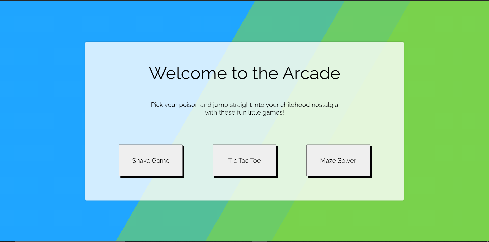
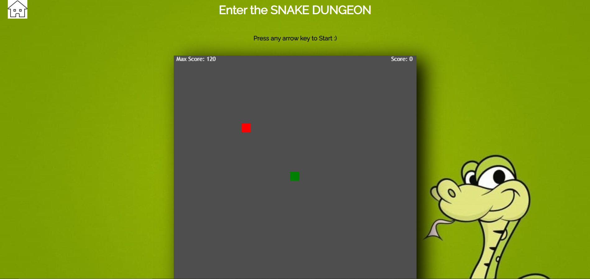
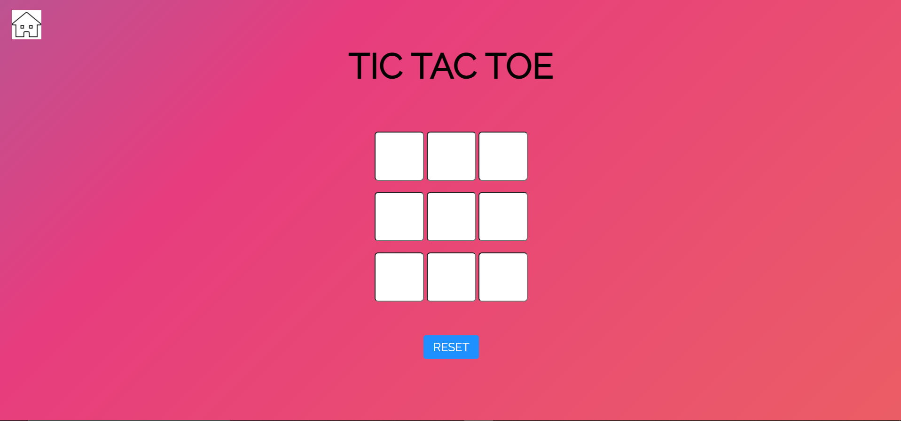
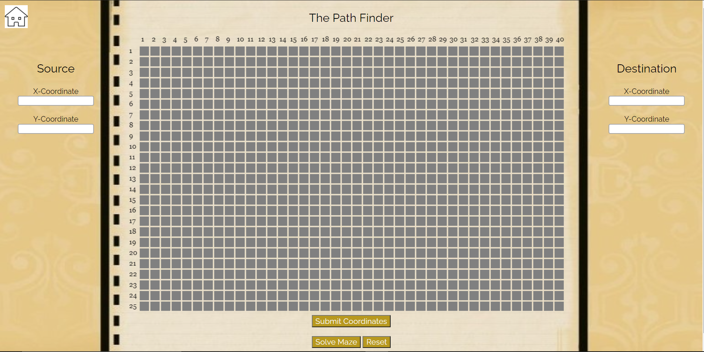

# Arcade

## About the project

This is an interactive project to reinvent the old-school games which everyone of us relived in our childhood in a web interface.

## * Built with

* HTML
* CSS
* Javascript

## * Preview 

* The initial homepage which welcomes the user with 3 options to access 3 games:
  * Snake Game
  * Tic Tac Toe
  * Maze Solver
  
This is how the homepage appears

## * How the games work

* Now if we click any of the buttons we are directed to the respective games

###   - Snake Game

* This was an attempt to design the old snake game everyone played on their devices back then. The controls are simple.
  * Press any arrow key to start the game.
  * Use arrow keys to navigate through the board.
  * The green cell represents the head of the snake and the red cells represent the food by consuming which the snake grows.

Preview of the game

###   - Tic Tac Toe

* This is the simple game where we draw a 3x3 grid for 2 players. The controls are as follows
  * Player 1 starts as 'X', Player 2 as 'O'
  * Player 1 starts game by clicking any of the 9 cells
  * It is turn based alternating between player 1 and 2
  * The player to mark 3 consecutive symbols of same type wins, else it is considered a draw
  
Preview of the game

###   - Maze Solver

* This is a game where we present a source and destination in a maze with various obstacles and we need to find a path between the source and destionation. This is similar to puzzles we do in our childhood behind the newspapers to find path between 2 points in a maze. The working is as follows
  * First we submit the source and destination coordinates in the 25x40 grid shown.
  * Now we add walls to the grid by clicking or dragging over cells.
  * Now we click the solve button which finds a path between the source and destination if possoble and marks it.

Preview of the game

## * Prerequisites

* An active internet connection
* Basic understanding of Web-Development and its tools
* HTML, CSS, Javascript

Note: This page will be updated in the future with a playable link when deployed soon! :D

# Happy Coding :D
